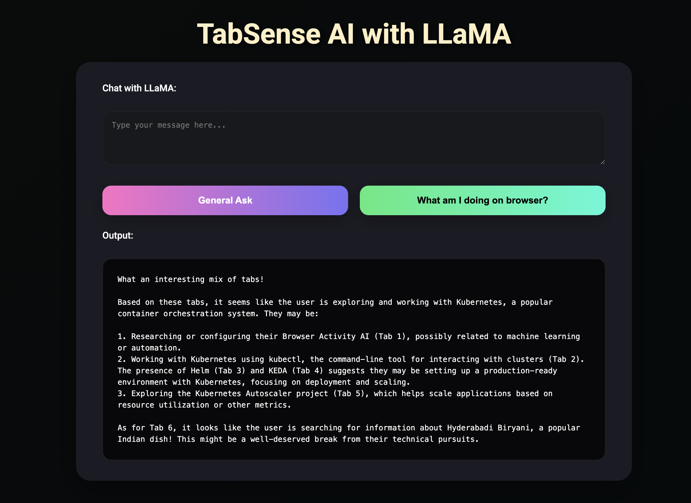
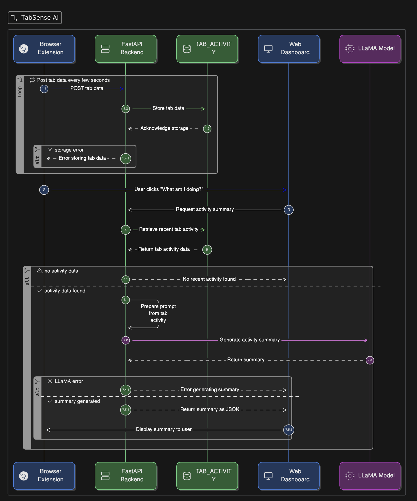

# TabSense AI: Local Browser Activity Summarizer

<p align="center">
  
</p>

<p align="center">
  
</p>

A privacy-first system to summarize your browser activity using a Chrome extension, a FastAPI backend, and a local LLM (LLaMA via Ollama).

---

## Features
- **Chrome Extension**: Collects tab/window info and minimal semantic content (headings, paragraphs) from active tabs only.
- **FastAPI Backend**: Receives, stores, and analyzes activity. Provides endpoints for chat and activity summary.
- **LLM Summarization**: Uses Ollama (LLaMA) locally for AI-powered summaries. No data leaves your machine.
- **Modern UI**: Simple, dark-themed dashboard for chat and activity queries.

---

## 1. Chrome Extension Setup

1. Go to `browser-activity-ai/extension/`.
2. Ensure these files exist:
   - `manifest.json`
   - `background.js`
   - `content.js`
   - (Optional) `popup.html` and icons
3. In Chrome, open `chrome://extensions`.
4. Enable **Developer mode** (top right).
5. Click **Load unpacked** and select the `extension/` folder.
6. The extension will now run in the background and send activity to your backend.

---

## 2. FastAPI Backend Setup

1. Go to `browser-activity-ai/backend/`.
2. Install dependencies (preferably in a virtualenv):
   ```sh
   python3 -m venv venv
   source venv/bin/activate
   pip install fastapi uvicorn requests
   ```
3. Start the backend:
   ```sh
   uvicorn app:app --reload
   ```
4. The API will be available at [http://127.0.0.1:8000](http://127.0.0.1:8000)

---

## 3. LLaMA (Ollama) Setup

1. [Download and install Ollama](https://ollama.com/download) for your OS.
2. Start Ollama:
   ```sh
   ollama serve
   ```
3. Pull the LLaMA model (or Qwen2.5):
   ```sh
   ollama pull llama3
   # or
   ollama pull qwen2:latest
   ```
4. Ollama should be running at `http://localhost:11434` (default in backend config).

---

## 4. API Endpoints

- `POST /activity` — Receives tab activity from the extension (JSON payload).
- `GET /activity` — Returns current active tab data.
- `POST /analyze` — Summarizes all tabs using LLaMA.
- `POST /chat` — General chat with LLaMA (send `{ "prompt": "..." }`).
- `GET /what-am-i-doing` — Returns a summary of your current browser activity.
- `GET /` — Modern web UI for chat and activity summary.

Test endpoints with [http://127.0.0.1:8000/docs](http://127.0.0.1:8000/docs) (FastAPI Swagger UI).

---

## 5. Required Python Packages
- fastapi
- uvicorn
- requests

Install with:
```sh
pip install fastapi uvicorn requests
```

---

## 6. How to Run Everything

1. **Start Ollama** (LLM):
   ```sh
   ollama serve
   ollama pull llama3
   ```
2. **Start FastAPI backend**:
   ```sh
   cd browser-activity-ai/backend
   uvicorn app:app --reload
   ```
3. **Load Chrome extension** (see above).
4. **Browse the web** — extension will send activity to backend.
5. **Open [http://127.0.0.1:8000](http://127.0.0.1:8000)** for the dashboard.

---

## 7. Design Notes & TODOs
- No raw HTML or incognito data is stored.
- All LLM calls are local (Ollama). No cloud API by default.
- TODO: Add authentication, persistent storage, and better intent classification.
- For OpenAI fallback, set your API key in the backend and adjust the code.

---

## 8. Troubleshooting
- If you see `pip: command not found`, use `python3 -m pip install ...`.
- If Ollama is not running, the backend will return LLaMA call errors.
- Use Chrome DevTools (background page) to debug extension issues.

---

## 9. Credits
- Built by Purushothama Reddy
- Uses [Ollama](https://ollama.com/) and [FastAPI](https://fastapi.tiangolo.com/)

---

Enjoy privacy-first, local browser activity AI! 🚀
